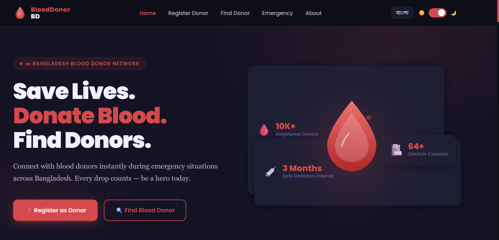
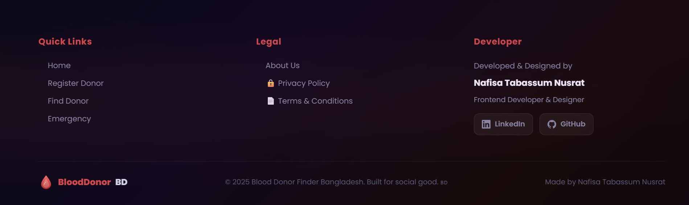

# Blood-Donation-Project

  <!--  -->
   

# 🩸 BloodDonor BD
### Saving Lives Through Smart Blood Donation

A modern web platform that connects blood donors with patients in need across Bangladesh.

---

# 🚀 About The Project

**BloodDonor BD** is a modern web platform built to help people quickly find blood donors during emergencies.

In many situations, patients and their families struggle to find blood donors at the right time. This platform aims to solve that problem by creating a **digital network of blood donors across Bangladesh**.

Users can register as donors, search for donors by blood group, and request blood when needed. The goal of this project is to make the blood donation process **faster, easier, and more accessible**.

---

# ✨ Key Features

### 🧑 Donor Registration
Users can easily register as blood donors by providing their basic information and blood group.

### 🔍 Find Blood Donor
Patients or relatives can quickly search for available blood donors.

### 🚨 Emergency Blood Request
Allows users to request blood during urgent medical situations.

### 🌐 Multi Language Support
Supports both **Bangla and English** languages for better accessibility.

### 🌙 Dark / Light Mode
Users can switch between **light mode and dark mode** for a better user experience.

### 📍 Nationwide Coverage
Designed to connect blood donors across **64+ districts in Bangladesh**.

---

# 🛠 Tech Stack

### Frontend
- HTML5
- CSS3
- JavaScript

### UI & Design
- Responsive Design
- Modern User Interface
- Custom Styling

### Functional Features
- Language Switcher
- Theme Toggle (Dark / Light Mode)
- Donor Search System

---

# 📸 Project Preview

### Homepage

Add your project screenshot here.

Example:
!
[About](image-3.png)

# 🎯 Project Goals

The purpose of this project is to:

- Help people **find blood donors quickly**
- Reduce delays during **medical emergencies**
- Promote **voluntary blood donation**
- Build a **nationwide digital blood donor network**

---

# 🔮 Future Improvements

Planned updates for the platform:

- User authentication system
- Real-time donor availability
- Emergency notification system
- Blood request tracking
- Mobile application version

---

# 👩‍💻 Developer

**Nafisa Tabassum Nusrat**

Front-End Developer passionate about building technology that solves real-world problems and helps people.

---

# ❤️ Support The Mission

Blood donation saves lives.

If you like this project, consider **sharing it and encouraging people to donate blood.**

⭐ **Star this repository if you found it useful!**